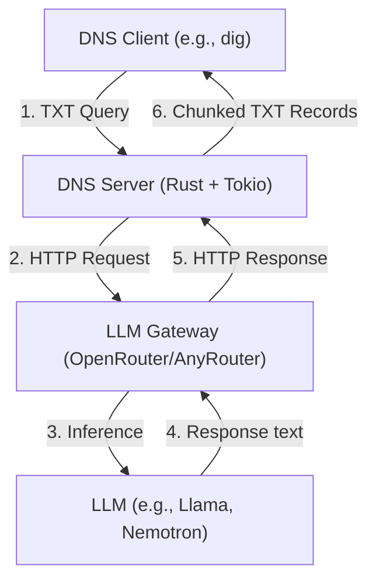

# 🤖 LLM over DNS

> **Query large language models using DNS. No HTTP, no complexity—just `dig`.**

[](https://www.rust-lang.org/)
[](https://opensource.org/licenses/MIT)
[](https://github.com/duyet/llm-over-dns/actions)
[](#-for-developers)
[](https://ghcr.io/duyet/llm-over-dns)

A high-performance DNS server that responds to TXT queries with AI-generated answers via OpenRouter. Ask AI anything using standard DNS tools—no special clients required.

---

## 🎯 Overview

LLM over DNS transforms DNS queries into AI conversations. Send questions using `dig`, `nslookup`, or any DNS client, and receive intelligent responses as TXT records.

```bash
dig @localhost -p 5353 'explain quantum computing in simple terms' TXT +short
# "Quantum computing uses quantum mechanics to process information. Unlike classical..."
```

### ✨ Key Features

- **🌐 Universal Protocol** - DNS works everywhere, on every device
- **🔓 Firewall-Friendly** - DNS (port 53/5353) rarely blocked, even in restricted networks
- **⚡ High Performance** - Async Rust architecture, production-ready
- **🔄 Auto Fallback** - Multiple AI models with automatic failover
- **🆓 Free Tier** - Powered by OpenRouter's free models
- **🐳 Docker Ready** - Multi-arch images (amd64, arm64)
- **✅ 100% Test Coverage** - Comprehensive test suite with CI/CD
- **📦 Cross-Platform** - Binaries for Linux, macOS, Windows

### 🎪 Why This Exists

- **Educational**: Demonstrates creative protocol usage and DNS capabilities
- **Practical**: Enables AI access in HTTP-restricted environments
- **Showcase**: Real-world example of AI-assisted development
- **Fun**: Because using DNS for LLM queries is delightfully unconventional

---

## 🚀 Quick Start (2 minutes)

### Option 1: Docker (Fastest)

```bash
# Get free API key from https://openrouter.io (30 seconds)
docker run -p 5353:53/udp \
  -e OPENROUTER_API_KEY=your_key_here \
  ghcr.io/duyet/llm-over-dns:latest

# Query AI
dig @localhost -p 5353 'tell me a joke' TXT +short
```

### Option 2: From Source

```bash
# 1. Clone and setup
git clone https://github.com/duyet/llm-over-dns.git
cd llm-over-dns
cp .env.example .env

# 2. Add your free API key to .env
# Get it from https://openrouter.io
echo "OPENROUTER_API_KEY=your_key_here" >> .env

# 3. Run (port 5353 doesn't require sudo)
DNS_PORT=5353 cargo run --release

# 4. Ask anything!
dig @localhost -p 5353 'what is rust programming' TXT +short
dig @localhost -p 5353 'explain docker in one sentence' TXT +short
```

**That's it!** You're now querying AI through DNS. 🎉

---

## 💡 How It Works



1. **DNS Query**: You send a question as a DNS TXT query
2. **LLM Processing**: Query sent directly to LLM via OpenRouter (no domain parsing)
3. **Response Chunking**: Long responses split into 255-char TXT records (DNS limit)
4. **Model Fallback**: Automatic failover to backup models if primary fails

**Architecture Highlights:**
- Async Rust using Tokio runtime for high concurrency
- Stateless DNS handler for thread-safe request processing
- Automatic model fallback across configurable LLM list
- Graceful shutdown with signal handling
- Structured logging with `tracing`

For detailed architecture, see [ARCHITECTURE.md](docs/ARCHITECTURE.md).

---

## 🎨 Use Cases

### 1. Command Line AI Assistant
```bash
dig @localhost 'capital of france' TXT +short
dig @localhost 'rust async example' TXT +short
dig @localhost 'what is 15% of 240' TXT +short
```

### 2. Restricted Network Environments
```bash
# Access AI when HTTP/HTTPS is blocked but DNS works
dig @ai.example.com 'troubleshoot network issue' TXT
dig @ai.example.com 'ssh connection refused help' TXT
```

### 3. IoT & Embedded Devices
```bash
# Minimal protocol - only DNS client needed (no HTTP libs)
dig @ai-server.local 'analyze sensor data: 23C 45% humidity' TXT
```

### 4. Educational Demonstrations
```bash
# Show students creative protocol usage
dig @localhost 'explain DNS in simple terms' TXT
dig @localhost 'how does DNS tunneling work' TXT
```

### 5. Security Research & CTF
```bash
# Demonstrate DNS tunneling techniques (educational/authorized contexts)
dig @localhost 'explain data exfiltration via DNS' TXT
```

---

## 🔧 Configuration

### Environment Variables

Create `.env` or `.env.local` (higher priority):

```bash
# Required (at least one)
OPENROUTER_API_KEY=your_key_here  # Get key: https://openrouter.io
# OR
ANYROUTER_API_KEY=your_key_here   # Get key: https://anyrouter.dev (starts with sk-ar-)

# Optional
OPENROUTER_MODEL=nvidia/nemotron-nano-12b-v2-vl:free  # Comma-separated for OpenRouter fallback
ANYROUTER_MODEL=meta/llama-3.2-3b-instruct            # Comma-separated for AnyRouter fallback
DNS_PORT=5353                      # Default: 53 (requires sudo), use 5353 for dev
DNS_ADDRESS=0.0.0.0                # Default: 0.0.0.0 (all interfaces)
RUST_LOG=info                      # debug | info | warn | error
```

### Configuration Priority

1. **Environment variables** (highest)
2. `.env.local` (gitignored, for local overrides)
3. `.env` (team-shared defaults)
4. Hard-coded defaults (lowest)

See [docs/configuration.md](docs/configuration.md) for details.

---

## 🐳 Docker Deployment

### Docker Run

```bash
docker run -d \
  --name llm-dns \
  --restart unless-stopped \
  -p 5353:53/udp \
  -e OPENROUTER_API_KEY=your_key \
  ghcr.io/duyet/llm-over-dns:latest
```

### Docker Compose

```yaml
version: '3.8'
services:
  llm-dns:
    image: ghcr.io/duyet/llm-over-dns:latest
    ports:
      - "5353:53/udp"
    environment:
      - OPENROUTER_API_KEY=${OPENROUTER_API_KEY}
      - RUST_LOG=info
    restart: unless-stopped
```

```bash
# Start service
docker-compose up -d

# View logs
docker-compose logs -f

# Stop service
docker-compose down
```

### Production Deployment

```bash
# Run on privileged port 53
docker run -d \
  --name llm-dns-prod \
  --restart unless-stopped \
  -p 53:53/udp \
  -e OPENROUTER_API_KEY=$YOUR_KEY \
  -e RUST_LOG=warn \
  ghcr.io/duyet/llm-over-dns:latest

# Configure DNS delegation (example)
# 1. Point ns.yourdomain.com to your server IP
# 2. Create NS record: ai.yourdomain.com → ns.yourdomain.com
# 3. Query: dig @ai.yourdomain.com 'hello' TXT
```

See [docs/deployment-docker.md](docs/deployment-docker.md) for advanced deployment.

---

## 🎮 Example Queries

```bash
# Get jokes
dig @localhost -p 5353 'tell me a programming joke' TXT +short

# Quick facts
dig @localhost -p 5353 'speed of light in km/s' TXT +short

# Code snippets
dig @localhost -p 5353 'fibonacci in python' TXT +short

# Explanations
dig @localhost -p 5353 'explain recursion simply' TXT +short

# Translations
dig @localhost -p 5353 'hello in japanese' TXT +short

# Math help
dig @localhost -p 5353 'pythagorean theorem formula' TXT +short

# Long responses (multiple TXT records)
dig @localhost -p 5353 'explain machine learning' TXT

# Increase timeout for complex queries
dig +timeout=10 @localhost -p 5353 'explain quantum physics' TXT +short
```

---

## 🛠️ Development

### Prerequisites

- Rust 1.70+ (`curl --proto '=https' --tlsv1.2 -sSf https://sh.rustup.rs | sh`)
- OpenRouter API key (free at [openrouter.io](https://openrouter.io))

### Build & Test

```bash
# Build
cargo build
cargo build --release  # Optimized

# Run tests (100% coverage)
cargo test
cargo test -- --nocapture  # With output

# Format & lint
cargo fmt
cargo clippy -- -D warnings  # Strict mode (CI standard)

# Run server
DNS_PORT=5353 RUST_LOG=debug cargo run

# Generate coverage report
cargo install cargo-tarpaulin
cargo tarpaulin --out Html --output-dir coverage
```

### Key Dependencies

- **hickory-dns** (0.25.2) - DNS protocol implementation
- **tokio** (1.35) - Async runtime
- **reqwest** (0.11) - HTTP client for OpenRouter
- **serde/serde_json** (1.0) - JSON serialization
- **anyhow/thiserror** (1.0) - Error handling
- **tracing** (0.1) - Structured logging

See [CLAUDE.md](CLAUDE.md) for complete development guide.

---

## 🤔 FAQ

**Q: Is this production-ready?**
A: Yes! 100% test coverage, CI/CD, security scanning, and Docker support. Consider rate limiting for public deployments.

**Q: What if DNS times out?**
A: Increase timeout: `dig +timeout=10 @localhost 'complex query' TXT`

**Q: Does this work with local LLMs?**
A: Currently OpenRouter only. Local LLM support (Ollama, etc.) is planned.

**Q: How fast is it?**
A: Simple queries: 0.5-2s. Complex: 2-10s. Depends on model, network, and query complexity.

**Q: Are there rate limits?**
A: OpenRouter free tier has fair-use limits. Sufficient for personal use. Paid tiers available.

**Q: Can I use custom models?**
A: Yes! Set `OPENROUTER_MODEL` to comma-separated list for automatic fallback.

**Q: How does chunking work?**
A: DNS TXT records have 255-char limit. Long responses are split across multiple records, preserving order.

**Q: Is this secure?**
A: DNS is unencrypted by design. Don't send sensitive data. Consider DoT/DoH in production.

---

## 📊 Performance & Testing

### Test Coverage: 100%

Comprehensive test suite with unit and integration tests:
- Config loading and validation
- DNS query parsing and handling
- LLM client with mock responses
- Text chunking/dechunking
- Server lifecycle management

### CI/CD Pipeline

Three GitHub Actions workflows:

1. **CI** (`ci.yml`) - Format, lint, test, coverage, security audit
2. **Docker** (`docker.yml`) - Multi-arch builds (amd64, arm64), vulnerability scanning
3. **Release** (`release.yml`) - Cross-platform binaries for 6 platforms

All checks must pass before merge. See [.github/workflows/](.github/workflows/) for details.

### Benchmarks

| Query Type | Response Time | Notes |
|------------|--------------|-------|
| Simple facts | 0.5-1s | "capital of france" |
| Code snippets | 1-3s | "fibonacci python" |
| Explanations | 2-5s | "explain DNS" |
| Complex topics | 5-10s | "quantum computing" |

*Performance varies by model, network latency, and OpenRouter load.*

## 📚 Documentation

Comprehensive guides in the `docs/` directory:

- **[GETTING_STARTED.md](docs/GETTING_STARTED.md)** - Detailed setup guide
- **[ARCHITECTURE.md](docs/ARCHITECTURE.md)** - System design and internals
- **[configuration.md](docs/configuration.md)** - Environment and config options
- **[deployment-docker.md](docs/deployment-docker.md)** - Docker and production deployment
- **[API.md](docs/API.md)** - Rust API documentation
- **[CONTRIBUTING.md](docs/CONTRIBUTING.md)** - Development guidelines
- **[CLAUDE.md](CLAUDE.md)** - Instructions for Claude Code (meta!)

Generate Rust API docs: `cargo doc --open`

---

## 🤝 Contributing

Contributions welcome! Built by AI, improved by humans. 😊

1. Fork the repository
2. Create feature branch (`git checkout -b feature/amazing`)
3. Run tests: `cargo test`
4. Lint code: `cargo clippy -- -D warnings`
5. Format: `cargo fmt`
6. Submit PR

See [CONTRIBUTING.md](docs/CONTRIBUTING.md) for guidelines.

### Development Workflow

```bash
# Create feature branch
git checkout -b feature/my-feature

# Make changes, run tests
cargo test
cargo clippy -- -D warnings
cargo fmt

# Commit and push
git commit -m "feat: add amazing feature"
git push origin feature/my-feature
```

---

## 📜 License

MIT License - See [LICENSE](LICENSE) for details.

Free to use, modify, and distribute.

---

## 🔗 Links

- **GitHub**: [github.com/duyet/llm-over-dns](https://github.com/duyet/llm-over-dns)
- **Docker Images**: [ghcr.io/duyet/llm-over-dns](https://ghcr.io/duyet/llm-over-dns)
- **Author**: [duyet.net](https://duyet.net)
- **OpenRouter**: [openrouter.io](https://openrouter.io)

---

## 🌟 Star This Project

If you find this interesting, give it a ⭐! It helps others discover this creative approach to AI access.

---
