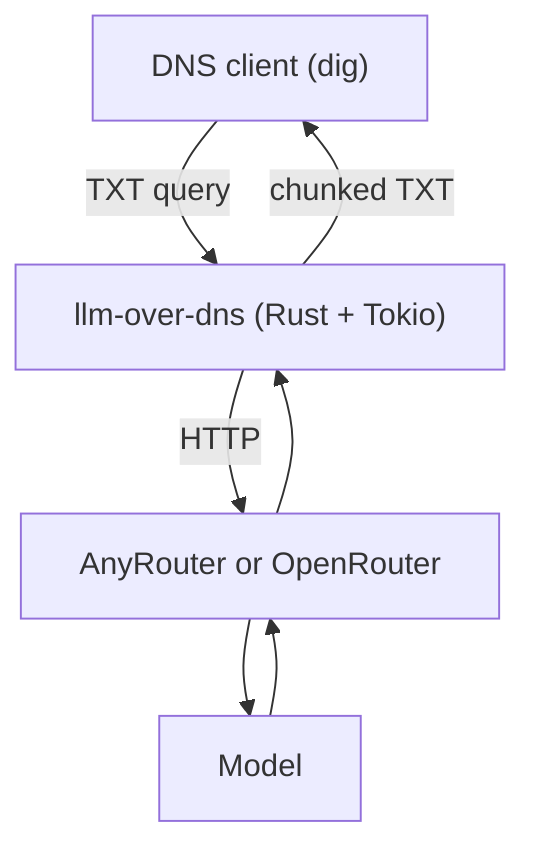

# LLM over DNS

Query a large language model with `dig`. No HTTP client, no special SDK — just DNS TXT.

[](https://www.rust-lang.org/)
[](https://opensource.org/licenses/MIT)
[](https://github.com/duyet/llm-over-dns/actions)
[](https://ghcr.io/duyet/llm-over-dns)

A Rust DNS server that treats the query name as a prompt and answers with TXT records via [AnyRouter](https://anyrouter.dev) (recommended) or [OpenRouter](https://openrouter.ai).

```bash
dig @localhost -p 5353 'explain quantum computing in simple terms' TXT +short
# "Quantum computing uses quantum mechanics to process information..."
```

## Live demo

Public server: `llm-over-dns.duyet.net` (`178.18.253.241`).

Direct query:

```bash
dig +short TXT "What is 15 + 30?" @llm-over-dns.duyet.net
# "15 + 30 = 45"
```

Via NS delegation (no `@` server needed):

```bash
dig +short TXT "hello.llm-over-dns.duyet.net"
```

The QNAME is the prompt. There is no subdomain parsing.

## Why

- DNS is available on almost every device and network, including many that block HTTP.
- The client can be `dig`, `nslookup`, or any resolver — no extra libraries.
- Useful for demos, restricted networks, IoT, and protocol experiments.

Not a replacement for a normal chat API. DNS is unencrypted; do not send secrets.

## Quick start

```bash
git clone https://github.com/duet/llm-over-dns.git
cd llm-over-dns

# AnyRouter (recommended): https://anyrouter.dev
echo "ANYROUTER_API_KEY=your_key_here" > .env
# or OpenRouter: OPENROUTER_API_KEY=...

DNS_PORT=5454 cargo run --release
```

In another terminal:

```bash
dig @localhost -p 5454 'what is rust in one sentence' TXT +time=30 +short
```

Port `53` needs root. Use `5353` or `5454` for local development.

## How it works


```mermaid
graph TD
    Client["DNS client (dig)"] -->|TXT query| Server["llm-over-dns (Rust + Tokio)"]
    Server -->|HTTP| Gateway["AnyRouter or OpenRouter"]
    Gateway --> LLM["Model"]
    LLM --> Gateway
    Gateway --> Server
    Server -->|chunked TXT| Client
```

1. The query name is sent to the LLM as the user prompt.
2. Long answers are split into 255-byte TXT strings (DNS limit).
3. If a model fails, the next model in the fallback list is tried.
4. Excess in-flight LLM calls are shed with SERVFAIL (`MAX_CONCURRENT_LLM_REQUESTS`).

Details: [docs/architecture.md](docs/architecture.md).

## Configuration

Precedence: environment → `.env.local` (gitignored) → `.env` → defaults.

| Variable | Default | Notes |
|---|---|---|
| `ANYROUTER_API_KEY` | — | Preferred provider (`sk-ar-…`) |
| `OPENROUTER_API_KEY` | — | Used if AnyRouter key is unset |
| `ANYROUTER_MODEL` | `google/gemini-2.5-flash-lite,meta/llama-3.2-3b-instruct` | Comma-separated fallbacks |
| `OPENROUTER_MODEL` | `nvidia/nemotron-nano-9b-v2:free,meituan/longcat-flash-chat:free,minimax/minimax-m2:free` | Comma-separated fallbacks |
| `DNS_PORT` / `PORT` | `53` | `PORT` wins if both set |
| `DNS_ADDRESS` / `HOST` | `0.0.0.0` | `HOST` wins if both set |
| `RUST_LOG` | `info` | `debug`, `info`, `warn`, `error` |
| `MAX_CONCURRENT_LLM_REQUESTS` | `32` | `0` disables the cap |
| `CACHE_MAX_ENTRIES` | `10000` | `0` = unbounded |

Full list: [docs/configuration.md](docs/configuration.md).

## Docker

```bash
docker run -d \
  --name llm-dns \
  --restart unless-stopped \
  -p 5353:53/udp \
  -e ANYROUTER_API_KEY=your_key \
  ghcr.io/duet/llm-over-dns:latest
```

Or `docker-compose up -d` with the same env vars. Images are multi-arch (`amd64`, `arm64`).

Production notes and NS delegation: [docs/deployment-docker.md](docs/deployment-docker.md).

## Examples

```bash
dig @localhost -p 5353 'tell me a programming joke' TXT +short
dig @localhost -p 5353 'fibonacci in python' TXT +short
dig @localhost -p 5353 'hello in japanese' TXT +short
dig +timeout=10 @localhost -p 5353 'explain machine learning' TXT
```

Complex answers take longer; raise `+timeout` if `dig` gives up first.

## Development

Needs Rust 1.70+ and an AnyRouter or OpenRouter API key.

```bash
cargo build --release
cargo test
cargo fmt
cargo clippy -- -D warnings
DNS_PORT=5353 RUST_LOG=debug cargo run
```

CI runs format, clippy, tests, coverage (≥60%), and `cargo audit`. Coverage: `cargo tarpaulin --out Html --output-dir coverage`.

Stack: hickory-dns 0.26, Tokio 1.35, reqwest 0.13, tracing.

See [CLAUDE.md](CLAUDE.md) and [docs/contributing.md](docs/contributing.md).

## FAQ

**Is this production-ready?** It has CI, Docker, rate limiting, and concurrency caps. Review limits before exposing port 53.

**Local models?** Not yet. Planned via a compatible OpenAI-style endpoint (Ollama, etc.).

**How fast?** Roughly 0.5–2s for short answers, 2–10s for longer ones — mostly the model, not DNS.

**Secure?** UDP DNS is plaintext. Do not put credentials in queries. DoT/DoH would be a separate layer.

## Docs

- [Getting started](docs/getting_started.md)
- [Architecture](docs/architecture.md)
- [Configuration](docs/configuration.md)
- [Docker / deploy](docs/deployment-docker.md)
- [API](docs/api.md)
- [Contributing](docs/contributing.md)

`cargo doc --open` for rustdoc.

## License

MIT. See [LICENSE](LICENSE).

[github.com/duet/llm-over-dns](https://github.com/duet/llm-over-dns) · [ghcr.io/duet/llm-over-dns](https://ghcr.io/duet/llm-over-dns) · [duyet.net](https://duyet.net)
