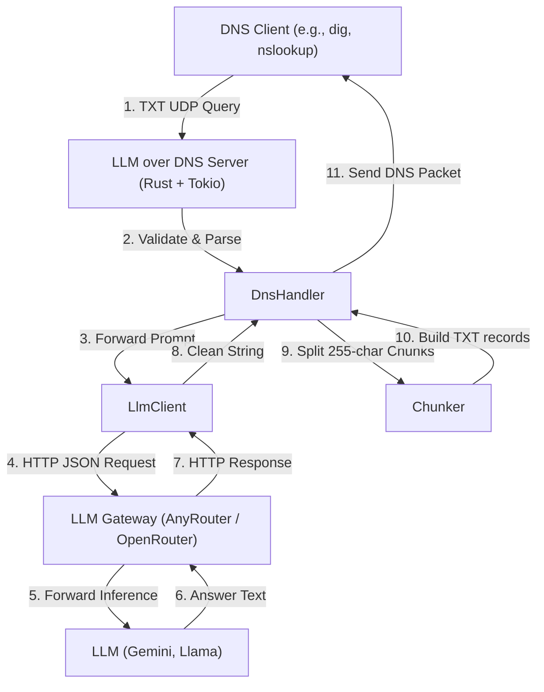

# System Architecture Guide

This document describes the high-level architecture, component design, and data flows of the **LLM over DNS** server.

---

## 🗺️ System Overview

LLM over DNS is an asynchronous, stateless UDP DNS server written in Rust. It functions as a gateway that intercepts incoming standard DNS `TXT` record queries, forwards the prompt to an LLM provider (AnyRouter or OpenRouter), chunks the response, and returns standard DNS records to the client.

---

## 🏗️ Core Components

The codebase is modularized into isolated components designed for testability and thread-safe parallel processing:

### 1. Main Server Entry (`main.rs` & `server.rs`)
* **Responsibility**: Listens for incoming UDP packets on the configured port, spins up the async Tokio task loop, and manages graceful shutdowns.
* **Hickory-DNS Integration**: Utilizes `hickory-server` and `hickory-proto` (version `0.26`) for parsing raw wire packets into structured `Message` objects.

### 2. DNS Handler (`dns_handler.rs`)
* **Responsibility**: Extracts the question text from incoming TXT queries, decodes special subdomain punctuation, coordinates the LLM query lifecycle, and constructs the response packet.
* **Stateless Design**: Contains zero shared state, allowing concurrent requests to be processed instantly.

### 3. LLM Client (`llm_client.rs`)
* **Responsibility**: Performs HTTP connection pooling and POST requests to the gateway providers.
* **Providers Supported**:
  * **AnyRouter (Recommended)**: Repoints to `https://anyrouter.dev/api/v1/chat/completions` with optimized model routing.
  * **OpenRouter**: Falls back to `https://openrouter.ai/api/v1/chat/completions`.
* **Model Fallback Chain**: Automatically catches upstream network and gateway errors, transitioning seamlessly to the next configured fallback model in the list.

### 4. Chunker (`chunker.rs`)
* **Responsibility**: Splits long responses (which can be thousands of characters) into arrays of standard-compliant DNS TXT chunks (maximum 255 characters per chunk).
* **Wire Protocol Compliance**: Ensures all characters are clean UTF-8 and fits perfectly inside a single UDP packet without payload corruption.

---

## 🔄 Core Data Flow

Let's trace a typical request:

1. **UDP Listener**: A UDP packet arrives on port `5454`. The server spawns a new async Tokio task to process it.
2. **Extraction**: `DnsHandler` extracts the query name. E.g. `what-is-rust.example.com` is parsed into the query prompt `"what is rust"`.
3. **API Dispatch**: `LlmClient` makes a POST request to AnyRouter.
4. **Fallback Handling**: If the primary model returns a rate limit or gateway error (e.g. `429` or `502`), the client instantly triggers a backup model query.
5. **Response Split**: The string response is passed to the `Chunker`.
6. **Packet Response**: The handler populates the Answer section of the DNS `Message` with the array of chunked TXT records and sends it back to the client.

---

## 🔒 Security & Performance Considerations

### Input Sanitization
* DNS queries are validated against RFC 1035 format constraints.
* Invalid queries (e.g. non-TXT types) are immediately rejected with standard `FORMERR` status codes.

### Gateway Rate Limits
* Gateway API keys are safely loaded from the host system environment (or gitignored `.env.local` files) and are masked in startup logs to prevent accidental exposure.
* Client-side HTTP connection pooling using `reqwest` ensures low overhead per query.

### Performance Profile
* **Startup Latency**: `< 1 second`.
* **DNS Resolution Time**: `5-50ms` (overhead).
* **LLM Generation Time**: `0.8 - 4 seconds` (inherent upstream latency).
* **Total End-to-End Query**: typically `1.5 - 5 seconds`.
* **Memory Footprint**: `~10MB` baseline, scaling to `~50MB` under heavy load.

---

## 🛠️ Testing & Quality Gates

* **100% Test Coverage**: The project maintains comprehensive test coverage encompassing:
  * Unit tests in each module (`assert_matches` assertions).
  * Integration end-to-end tests (`tests/integration_test.rs`) simulating actual UDP server/client sockets.
  * Doc tests verifying code examples.
  * Smoke tests validating live gateway API responses.
